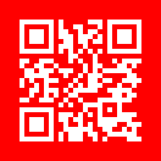
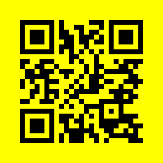

#  ShareShark - Fast file sharing Discord bot 🦈📄  
 
**ShareShark** is a Discord Bot that… 

* Takes a file sent in a Discord Server
* Uploads it to a remote web service using HTTP
* Generates a custom QR-code to the uploaded file
* Gives feedback to file sender

… all while the user gets real-time status updates

## Setup
1. Add the Discord bot to your server using the URL below (requires server admin privileges)
2. Change `the DISCORD_BOT_TOKEN` in `env.py` to your own bot token
3. Run the bash- or python script

## Usage
1. Send a message in any channel where the bot has the privileges to read/write messages. The message MUST include the following:
   * The file you want to upload
   * A mention “@ShareShark” of the bot
2. You will then receive a status window that will update in real-time.
3. If the file is uploaded successfully, it will then generate and sent a QR-code to the file  

## Customization
By changing the parameters you can customize the QR-code to your liking.
You can then scan them with whatever app you prefer. (Tested with Google Lens)  

## Technologies used
* Python libraries: Discord, requests, PIL, qrcode, ...
* Discord bot API
* *DALL-E: ShareShark logo
## License
ShareShark is released under the **<u>[MIT License](https://opensource.org/licenses/MIT)</u>**.  
